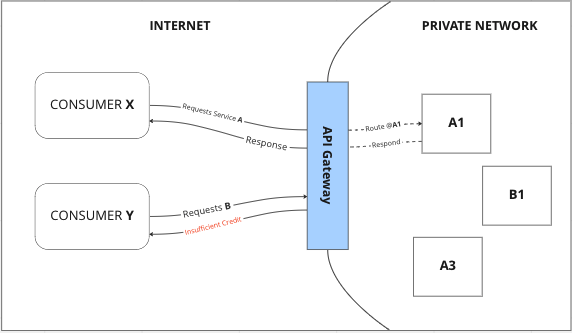

# UWS API Gateway

> We will not add load balancing features in this initial release to control complexity.

## Stack
- Rust
- Rocket

## Prerequisites
- Rust (We recommend using [rustup](https://rustup.rs/) installer)
## Installation & Development
To install the *gateway* you need to run the following command in your terminal to build project:

```sh
 cargo build
```
Run tests:
```sh
cargo test
```
Then run the server:
```sh
cargo run
```

> The server doesn't auto update when you change the code. Remember to restart the server after you update the code. If you know a way to auto-restart after code changes (like in Flask) please let us know.

## What's UWS API Gateway?
> In this document, I will assume a basic level of Software Engineering and basic knowledge about the Software as a Service (SaaS) model.



UWS Software as a Service (SaaS) API Gateway is a system that does the following:
1. Receives web requests from consumers.
2. Authenticates and routes the requests to destination services.
3. Charges customers according to their pricing plans.


