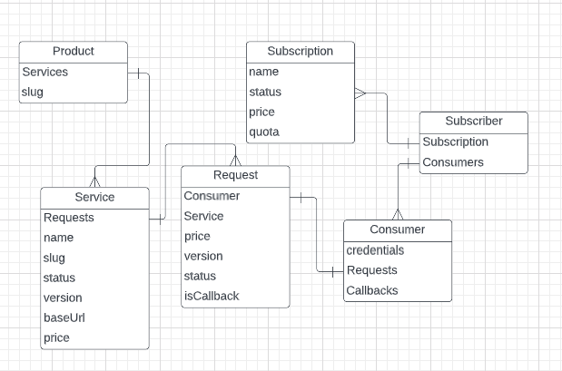

# UWS API Gateway

> We will not add load balancing features in this initial release to control complexity.

## Stack
- Rust
- Rocket

## Prerequisites
- Rust (We recommend using [rustup](https://rustup.rs/) installer)
## Installation & Development
To install the *gateway* you need to run the following command in your terminal to build project:

```sh
 cargo build
```
Run tests:
```sh
cargo test
```
Then run the server:
```sh
cargo run
```
### Auto reload
To trigger certain helpful actions when you update the code (like auto-restarting the server), install [cargo-watch](https://crates.io/crates/cargo-watch) 
```sh
cargo install cargo-watch
```

Then run the following command to start a server that re-runs with every code change
```sh
cargo watch -x run
```

You can also re-run tests with every code change
```sh
cargo watch -x test
```

## Concept
> In this document, I will assume a basic level of Software Engineering and basic knowledge about the Software as a Service (SaaS) model.


UWS Software as a Service (SaaS) API Gateway is a system that does the following:
1. Receives web requests from consumers.
2. Authenticates and routes the requests to destination services.
3. Charges customers according to their pricing plans.

## Structure

### High-level structures
> We will not add load balancing features in this initial release to control complexity.

The system is comprised of the following structures:

- [x] **Server**: authenticates & processes incoming *requests*.
- [x] **Data Layer**: accesses, queries and persists *data*.
- [ ] **Router**: routes requests to their correct destination inside a private network using a configurable map.
- [x] **Authenticator**: controls access of request consumers based on their credentials.
- [ ] **Biller**: Handles quota operations & subscriptions.
- [ ] **Logger**: collects traffic data and stores it in either files or databases.
- [ ] **Scheduler**: controls the flow of inbound and outbound requests.

### Quality Attributes
The gateway will do its job successfully if the following conditions are met:
1. The system functions well without errors according to spec.
2. The system fulfills quality attributes. 

The following quality attributes should be always taken into consideration while building the system:
1. **Performance:** Speed is critical because the gateway will intercept each and every request passing through the system.
2. **Interoperability**: Provided services should be discoverable and easy to communicate with.
3. **Maintainability**: The code base should be clean, agile and well-tested. The system should be able to self-diagnose and handle common errors.
4. **Security**: Stored customer data should be secured well. The system should always follow the basics of security.

> Considering quality attributes *is essential* to deliver the desired customer and business value.

## Entities


### Request
The request is the main artifact. A successful incoming request lifecycle is as follows:
1. *Server* intercepts incoming request.
2. *Authenticator* checks request for consumer login credentials & logs it.
3. *Biller* checks subscriber quota.
4. *Router* sends request to relevant service & responds to consumer.
5. *Biller* adds transaction to the subscriber account.

In the case of internal errors or malformed responses from the service, information will be logged and quota will not be deducted.
### Subscriber
The subscriber is representation of a customer or a partner business. A subscriber can have many Consumers. Consumers have access to the APIs and can consumer them once authenticated.

Subscribers can choose between different monthly or annual subscription packages, each package contains a monthly quota of tokens. Consuming services depletes this token quota. 

> Example: As a subscriber you have 10 token in your quota. Service A costs 2 tokens per request. Once you successfully hit Service A your quota will decrease to 8 token.


### Consumer
Consumers are the Subscribers' servers or machines. Usually operated by developers consumers will communicate with *gateway* using HTTP/HTTPS. 

> All requests from consumers should contain credentials that allows the system to detect and authenticate them.

Consumer history and activity are logged intensively in order to: 
1. Resolve conflicts 
2. Debug errors
2. Finding patterns to help us improve the system.
### Product
The product is an abstract group of services. A product's role in the system is to add structure. In later versions this abstraction will contribute in the functionality of load balancing.
### Service
A service is a program hosted on an instance somewhere in our private network. Consumer can access this service using a URL. 

Requests to certain services cost a different amount of tokens. AI processes for example cost more than simple graph API calls.

The gateway uses an updated map of all the services and how to reach them to process requests and respond to Consumers accordingly.

Each service has a version. Users can access different version of services using the following url scheme:

> protocol://[product.slug].uws.io/[service.slug]/**[service.version]**/*


